# 🚀 Mini ERP & CRM

A full-stack Mini Enterprise Resource Planning (ERP) and Customer Relationship Management (CRM) System built with React, Node.js, Express.js, Prisma, and PostgreSQL featuring JWT Authentication, Role-Based Access Control, Customer Management, Product Management, Inventory Management, Stock Movement Tracking, Sales Challan Management, Dashboard Analytics, and a modern responsive interface.

[)]([https://mini-erp-crm.vercel.app/](https://mini-erp-crm-chi-green.vercel.app/))
[](https://mini-erp-crm-api-ia60.onrender.com)
[](https://github.com/DevKatti7560/mini-erp-crm)

## 🌐 Live Demo

* 🚀 **Frontend / Live Demo:** https://mini-erp-crm-chi-green.vercel.app/
* ⚙️ **Backend API:** https://mini-erp-crm-api-ia60.onrender.com
* 📦 **GitHub:** https://github.com/DevKatti7560/mini-erp-crm

> **Note:** The frontend is deployed on Vercel and the backend API is deployed on Render.


# ✨ Features

### 🔐 Authentication

- JWT Authentication
- Secure Login
- User Registration
- Bcrypt Password Hashing
- Protected Routes
- Authentication Middleware
- Automatic Token Handling
- Unauthorized Access Protection
- Role-Based Access Control

### 👥 CRM Management

- Customer Management
- Customer Details
- Create Customers
- Update Customers
- Delete Customers
- Customer Types
- Customer Status
- GST Number Management
- Business Information
- Follow-Up Dates
- Customer Notes
- Pagination

### 📦 Product Management

- Product Management
- Create Products
- Update Products
- Delete Products
- SKU Management
- Product Categories
- Unit Price Management
- Warehouse Management
- Current Stock Tracking
- Minimum Stock Levels

### 📊 Inventory Management

- Stock IN
- Stock OUT
- Current Stock Tracking
- Inventory Movement History
- Stock Audit Trail
- Low Stock Monitoring
- Stock Validation
- Negative Stock Prevention

### 🧾 Sales Challans

- Create Sales Challans
- Customer Selection
- Multiple Product Selection
- Quantity Management
- Automatic Total Calculation
- Draft Challans
- Confirm Challans
- Cancel Challans
- Automatic Stock Reduction
- Automatic OUT Stock Movement
- Stock Availability Validation

### 📈 Dashboard

- Business Overview
- Customer Statistics
- Product Statistics
- Inventory Overview
- Challan Information
- Low Stock Information
- Recent Activity

### 🎨 User Experience

- Modern Responsive Interface
- Sidebar Navigation
- Role-Aware Navigation
- Active Navigation States
- Loading States
- Empty States
- Error Handling
- Toast Notifications
- Protected Pages
- Clean Dashboard UI

---

# 👤 User Roles

| **Role** | **Access / Responsibility** |
| -------- | --------------------------- |
| `ADMIN` | Full system administration |
| `SALES` | Customer and sales operations |
| `WAREHOUSE` | Inventory and stock operations |
| `ACCOUNTS` | Accounts-related operations |

### Registration Security

Public registration allows:

```text
SALES
WAREHOUSE
ACCOUNTS
```

The `ADMIN` role cannot be selected during public registration.

---

# 🛠 Tech Stack

| **Layer** | **Technologies** |
| --------- | ---------------- |
| Frontend | React.js, Vite, React Router, Axios, CSS3 |
| Backend | Node.js, Express.js |
| Database | PostgreSQL, Prisma ORM |
| Authentication | JWT, Bcrypt |
| API | REST API |
| Notifications | React Hot Toast |
| Development | VS Code, Git, GitHub, Postman, Prisma Studio |
| Deployment | Vercel, Render |

---

# 🏗 System Architecture

```text
                    React Frontend
                          │
                          │ Axios
                          ▼
                    REST API
                          │
                          ▼
                  Express.js Backend
                          │
              ┌───────────┴───────────┐
              │                       │
              ▼                       ▼
       Authentication          Business Logic
              │                       │
              ▼                       ▼
        JWT + Bcrypt             Controllers
                                      │
                                      ▼
                                Prisma ORM
                                      │
                                      ▼
                                PostgreSQL
```

---

## Deployment

```text
React + Vite
     │
     ▼
  Vercel
     │
     │ REST API
     ▼
Express + Node.js
     │
     ▼
  Render
     │
     ▼
PostgreSQL
```

- 🚀 **Frontend:** Vercel
- ⚙️ **Backend:** Render
- 🗄️ **Database:** PostgreSQL

---

# 📂 Folder Structure

```text
mini-erp-crm
│
├── client
│   │
│   ├── src
│   │   ├── components
│   │   │   ├── Header.jsx
│   │   │   ├── ProtectedRoute.jsx
│   │   │   └── Sidebar.jsx
│   │   │
│   │   ├── context
│   │   │   └── AuthContext.jsx
│   │   │
│   │   ├── pages
│   │   │   ├── Login.jsx
│   │   │   ├── Register.jsx
│   │   │   ├── Dashboard.jsx
│   │   │   ├── Customers.jsx
│   │   │   ├── CustomerDetails.jsx
│   │   │   ├── Products.jsx
│   │   │   ├── Inventory.jsx
│   │   │   ├── Challans.jsx
│   │   │   ├── CreateChallan.jsx
│   │   │   └── ChallanDetails.jsx
│   │   │
│   │   ├── services
│   │   │   └── api.js
│   │   │
│   │   ├── utils
│   │   │   └── permissions.js
│   │   │
│   │   ├── App.jsx
│   │   ├── index.css
│   │   └── main.jsx
│   │
│   └── package.json
│
├── server
│   │
│   ├── config
│   │   └── prisma.js
│   │
│   ├── controllers
│   │   ├── authController.js
│   │   ├── challanController.js
│   │   ├── customerController.js
│   │   └── productController.js
│   │
│   ├── middleware
│   │   ├── authMiddleware.js
│   │   └── roleMiddleware.js
│   │
│   ├── prisma
│   │   ├── migrations
│   │   └── schema.prisma
│   │
│   ├── routes
│   │   ├── authRoutes.js
│   │   ├── challanRoutes.js
│   │   ├── customerRoutes.js
│   │   └── productRoutes.js
│   │
│   ├── prisma.config.ts
│   ├── server.js
│   └── package.json
│
├── screenshots
│   ├── login.png
│   ├── register.png
│   ├── dashboard.png
│   ├── customers.png
│   ├── customer-details.png
│   ├── products.png
│   ├── inventory.png
│   ├── challans.png
│   ├── create-challan.png
│   ├── challan-details.png
│   └── negative-stock.png
│
├── .gitignore
├── README.md
└── LICENSE
```

---

# 🚀 Installation

## Clone Repository

```bash
git clone https://github.com/DevKatti7560/mini-erp-crm.git
cd mini-erp-crm
```

---

## Install Frontend

```bash
cd client
npm install
```

---

## Install Backend

```bash
cd ../server
npm install
```

---

# 🔑 Environment Variables

## Backend

Create:

```text
server/.env
```

Add:

```env
PORT=5000
DATABASE_URL=your_postgresql_connection_string
JWT_SECRET=your_secret_key
```

| **Variable** | **Description** |
| ------------ | --------------- |
| `PORT` | Backend server port |
| `DATABASE_URL` | PostgreSQL database connection string |
| `JWT_SECRET` | Secret key used for JWT authentication |

---

## Frontend

Create:

```text
client/.env
```

For local development:

```env
VITE_API_URL=http://localhost:5000/api
```

For production:

```env
VITE_API_URL=https://mini-erp-crm-api-ia60.onrender.com/api
```

| **Variable** | **Description** |
| ------------ | --------------- |
| `VITE_API_URL` | Backend API URL |

> ⚠️ Never commit `.env` files, database passwords, JWT secrets, or other credentials to GitHub.

---

# 🗄️ Database Setup

Navigate to the backend:

```bash
cd server
```

Generate Prisma Client:

```bash
npx prisma generate
```

Run database migration:

```bash
npx prisma migrate dev
```

Open Prisma Studio:

```bash
npx prisma studio
```

---

# ▶️ Run Backend

```bash
cd server
npm run dev
```

Backend:

```text
http://localhost:5000
```

Health Check:

```text
http://localhost:5000/api/health
```

---

# ▶️ Run Frontend

Open another terminal:

```bash
cd client
npm run dev
```

Frontend:

```text
http://localhost:5173
```

---

# 🔌 REST API

## 🔐 Authentication

```http
POST /api/auth/register
POST /api/auth/login
```

---

## 👥 Customers

```http
GET    /api/customers
POST   /api/customers
GET    /api/customers/:id
PUT    /api/customers/:id
DELETE /api/customers/:id
```

---

## 📦 Products

```http
GET    /api/products
POST   /api/products
GET    /api/products/:id
PUT    /api/products/:id
DELETE /api/products/:id
```

---

## 📊 Inventory

```http
GET  /api/products/movements
POST /api/products/:id/stock
```

---

## 🧾 Sales Challans

```http
GET  /api/challans
POST /api/challans
GET  /api/challans/:id

POST /api/challans/:id/confirm
POST /api/challans/:id/cancel
```

---

# 🛡️ Business Rules

## Stock Validation

The system validates available inventory before confirming a challan.

```text
Available Stock >= Requested Quantity
```

If stock is insufficient:

```text
❌ Challan confirmation rejected
```

---

## Draft Challan

Creating a draft does not affect inventory.

```text
Create Challan
      ↓
    DRAFT
      ↓
No Stock Reduction
```

---

## Confirm Challan

When a challan is confirmed:

```text
Draft Challan
      ↓
Validate Stock
      ↓
Reduce Product Stock
      ↓
Create OUT Stock Movement
      ↓
CONFIRMED
```

---

## Negative Stock Prevention

The application prevents inventory from becoming negative.

Example:

```text
Current Stock = 20
Requested Quantity = 50
```

Result:

```text
❌ Insufficient Stock
```

The transaction is rejected and the stock remains unchanged.

---

# 📊 Example Inventory Flow

Before confirmation:

```text
Wireless Keyboard → 50
Wireless Mouse    → 100
```

Challan:

```text
Wireless Keyboard → 5
Wireless Mouse    → 10
```

After confirmation:

```text
Wireless Keyboard → 45
Wireless Mouse    → 90
```

Stock movements:

```text
Keyboard → OUT → 5
Mouse    → OUT → 10
```

---

# 🧪 API Testing

The backend APIs can be tested using **Postman**.

### Authentication Testing

```text
Register
   ↓
Login
   ↓
Receive JWT Token
   ↓
Use Bearer Token
   ↓
Access Protected APIs
```

### Authorization Testing

```text
ADMIN
SALES
WAREHOUSE
ACCOUNTS
```

Protected APIs reject requests without valid authentication.

Example:

```text
No Token
   ↓
401 Unauthorized
```

Valid token:

```text
Bearer Token
   ↓
Protected API
   ↓
200 OK
```

---

# ☁️ Deployment

## 🚀 Frontend — Vercel

The React frontend is deployed using Vercel.

### Configuration

```text
Framework:
Vite

Root Directory:
client

Build Command:
npm run build

Output Directory:
dist
```

### Environment Variable

```text
VITE_API_URL=https://mini-erp-crm-api-ia60.onrender.com/api
```

---

## ⚙️ Backend — Render

The Express backend is deployed using Render.

### Configuration

```text
Root Directory:
server
```

### Build Command

```bash
npm install && npx prisma generate && npx prisma migrate deploy
```

### Start Command

```bash
npm start
```

### Node Version

```text
20.x
```

### Environment Variables

```text
DATABASE_URL
JWT_SECRET
```

---

# 📸 Screenshots

## 📝 Register

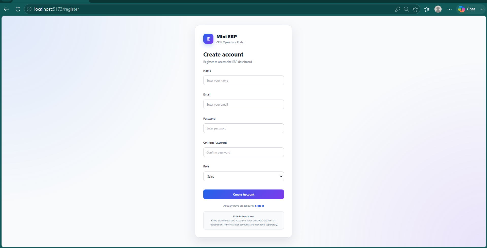

---

## 🔐 Login

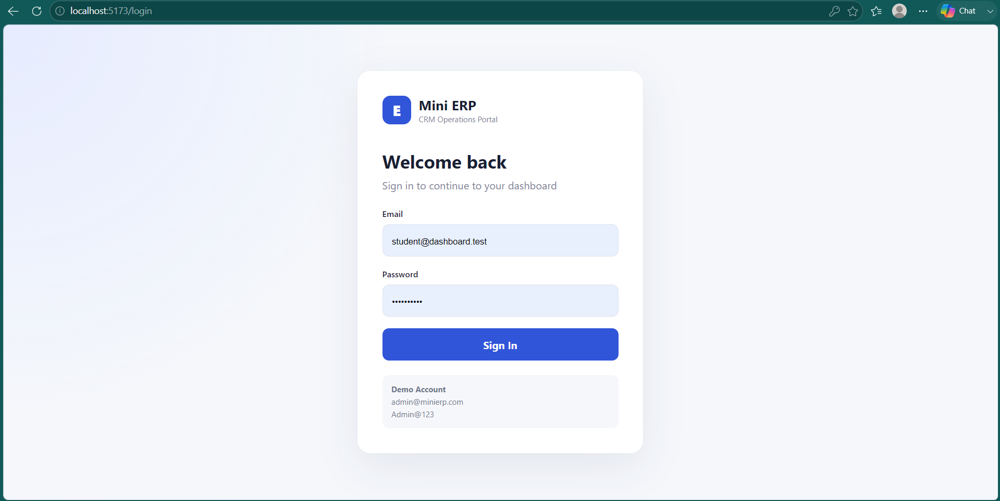

---

## 📊 Dashboard

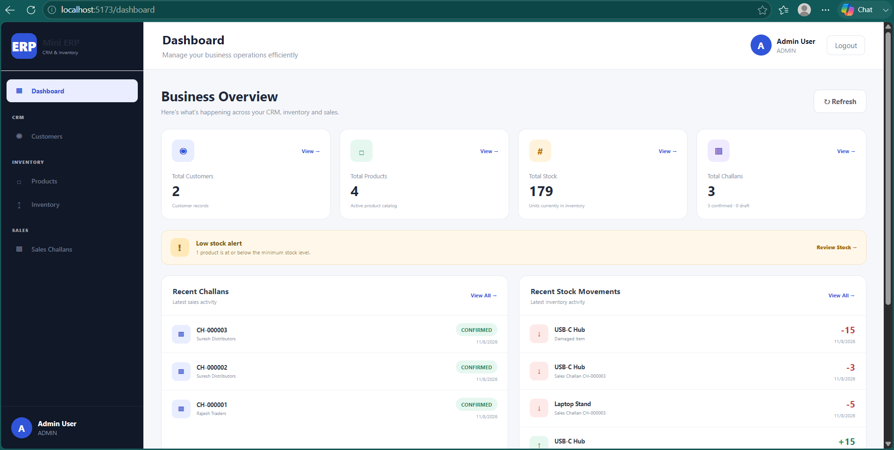

---

## 👥 Customers

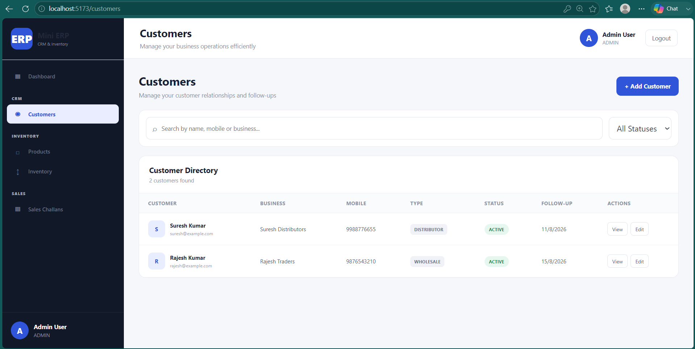

---

## 👤 Customer Details

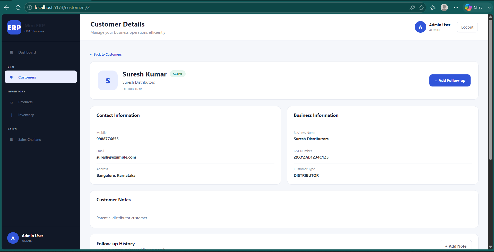

---

## 📦 Products

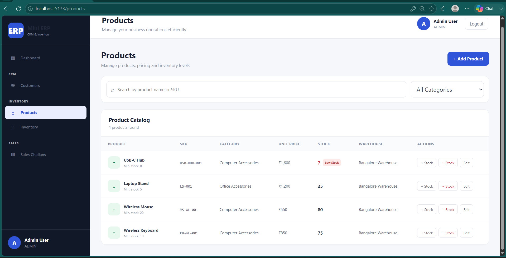

---

## 📊 Stock Management

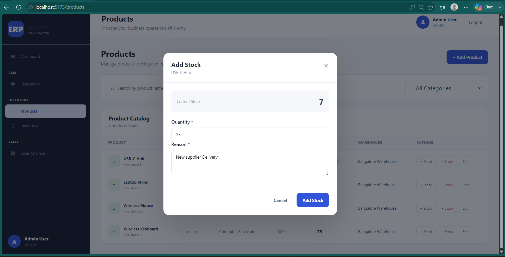

---

## 📋 Inventory Movements

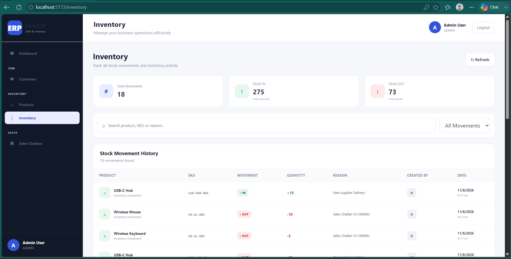

---

## 🧾 Sales Challans

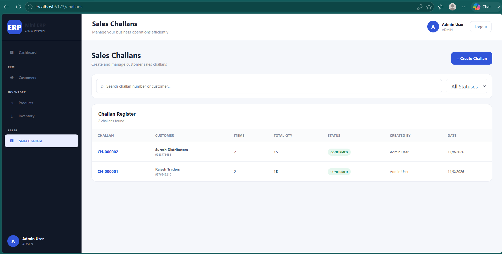

---

## ➕ Create Sales Challan

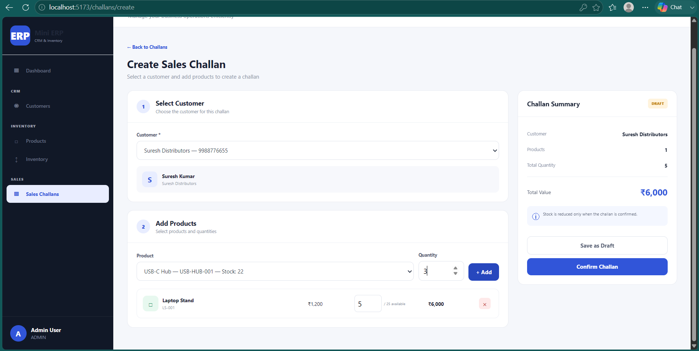

---

## 📄 Challan Details

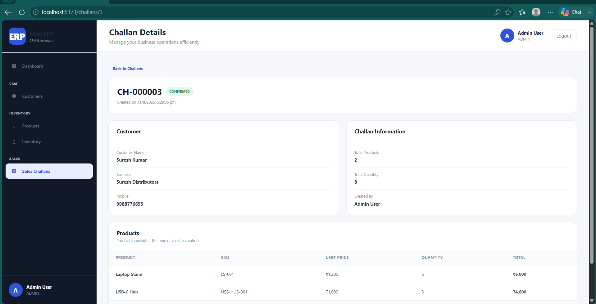

---

## 🚫 Negative Stock Validation

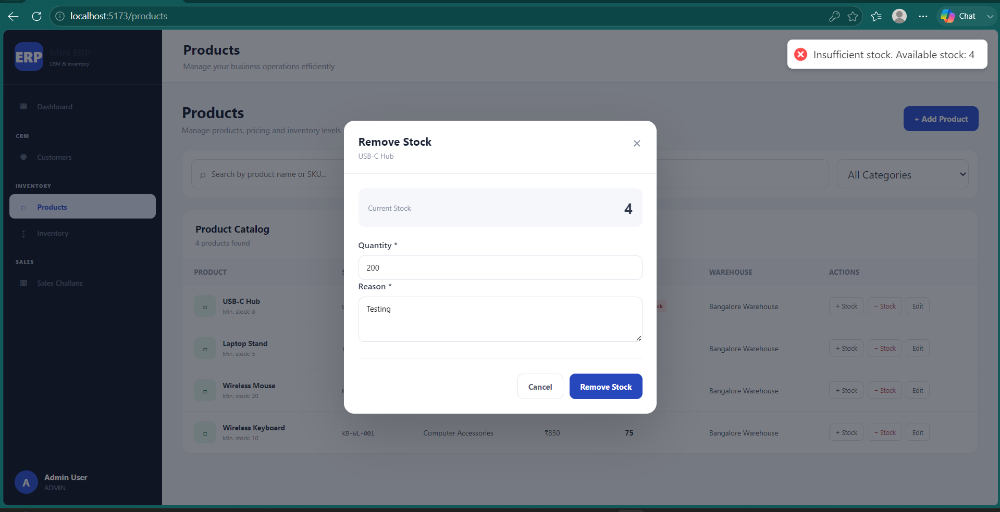

# 🚀 Future Enhancements

- 📄 PDF Challan Generation
- 🧾 Invoice Generation
- 📊 Advanced Business Analytics
- 📈 Advanced Reporting
- 📤 Excel / CSV Export
- 📧 Email Notifications
- 🔔 Notification System
- 👨‍💼 Admin User Management
- 🔑 Password Reset
- ✉️ Email Verification
- 📋 Advanced Audit Logs
- 📦 Inventory Forecasting
- 📊 Sales Analytics
- 🧪 Automated Testing
- 🔄 CI/CD Pipeline
- 📱 Progressive Web App (PWA)
- 🌍 Multi-Branch Support

---

# 🎓 Learning Outcomes

This project demonstrates practical experience in:

- Full-Stack Web Development
- React.js
- REST API Development
- Node.js & Express.js
- PostgreSQL
- Prisma ORM
- JWT Authentication
- Role-Based Access Control
- Database Design
- Inventory Management
- Business Logic Implementation
- API Integration
- Cloud Deployment
- Git & GitHub
- Postman API Testing

---

# 👨‍💻 Author

**Devaraja Katti**

AI & ML Engineering Student | Full Stack Developer | Machine Learning Enthusiast

### GitHub

https://github.com/DevKatti7560

### LinkedIn

https://www.linkedin.com/in/devaraja-katti-58136a2a1/

---

## ⭐ Support

If you like this project, don't forget to ⭐ the repository.

<div align="center">

### 🚀 Mini ERP & CRM

Built with ❤️ using

**React • Node.js • Express.js • Prisma • PostgreSQL**

</div>
